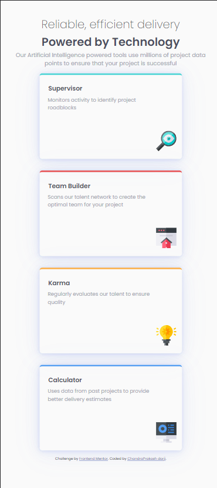
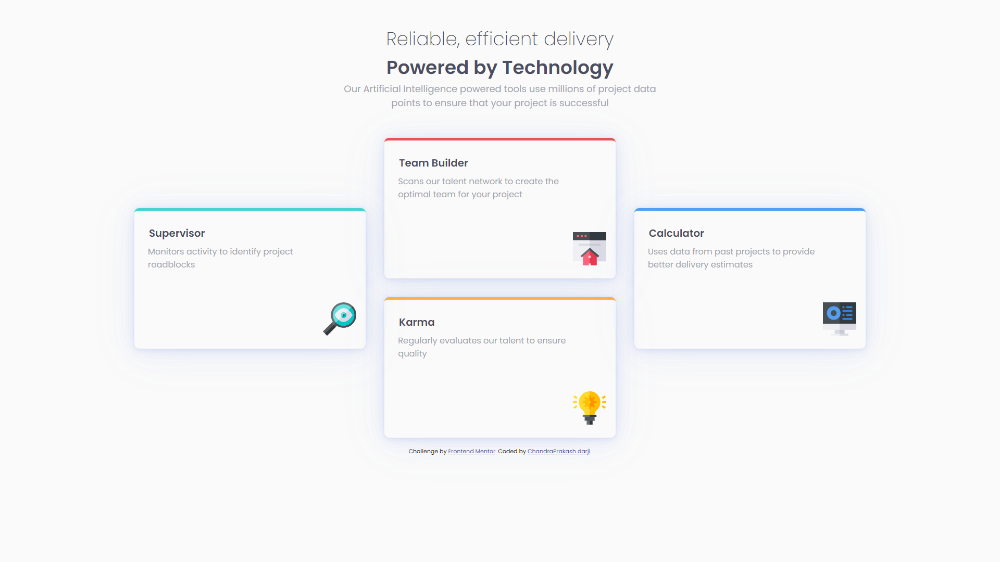

# Frontend Mentor - Order summary card solution

This is a solution to the [Order summary card challenge on Frontend Mentor](https://www.frontendmentor.io/challenges/four-card-feature-section-weK1eFYK/hub/four-card-feature-section-bcMYHsNUK). Frontend Mentor challenges help you improve your coding skills by building realistic projects. 

## Table of contents

- [Overview](#overview)
  - [The challenge](#the-challenge)
  - [Screenshot](#screenshot)
  - [Links](#links)
- [My process](#my-process)
  - [Built with](#built-with)
  - [Continued development](#continued-development)
  - [Useful resources](#useful-resources)
- [Author](#author)

## Overview

### The challenge

Users should be able to:

- See hover states for interactive elements

### Screenshot

### Links

- Solution URL:
          [HTML/CSS](https://github.com/Chandraprakash-Darji/four-card-feature-section-Frontend-Mentor/find/master)
- Live Site URL: [here](https://chandraprakash-darji.github.io/four-card-feature-section-Frontend-Mentor/)

## My process

### Built with

- Semantic HTML5 markup
- CSS Flexbox

### Continued development

Currently I will Work more flex Box And the em units and also the media query.

### Useful resources

- [Tabler Icon](https://tablericons.com/) - This helped me for Icon reason. I really liked this Website and u may go with it.

## Author

- Frontend Mentor - [@Chandraprakash-Darji](https://www.frontendmentor.io/profile/Chandraprakash-Darji)
- Linkedin - [Chandra Prakash](https://www.linkedin.com/in/chandra-prakash-6065b2224/)

